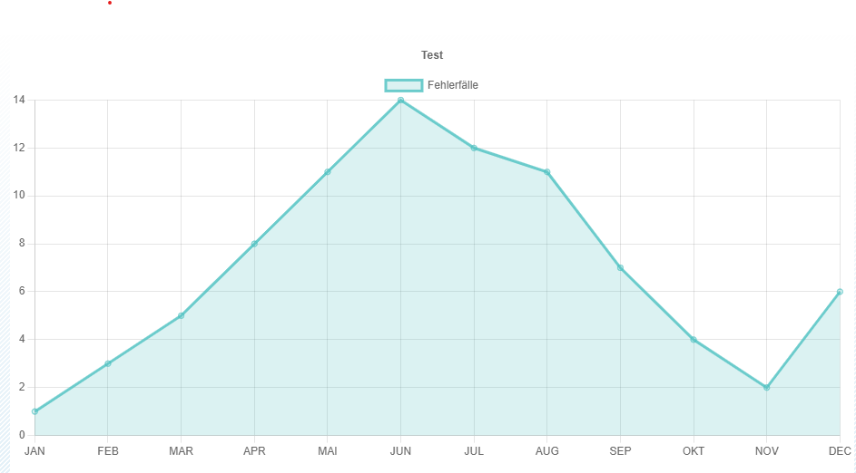
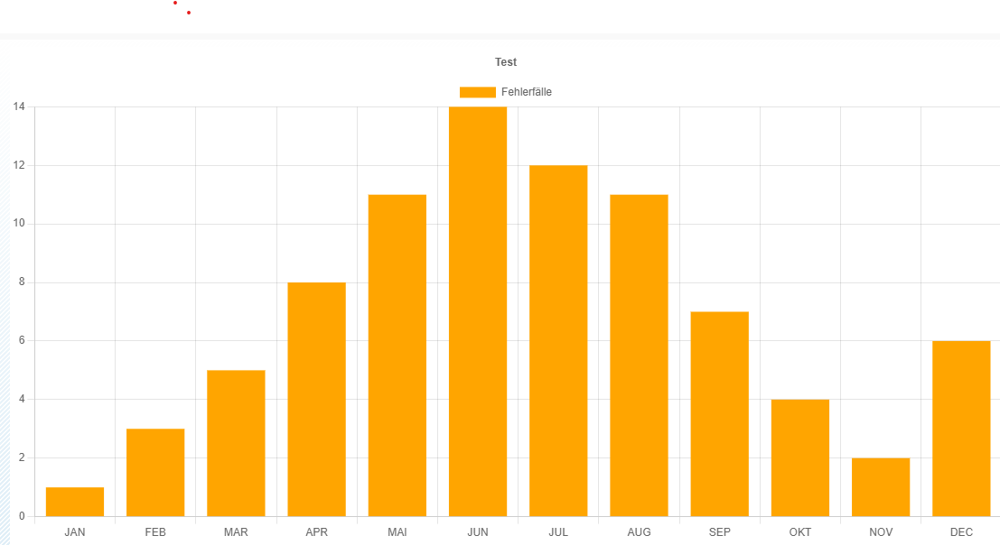
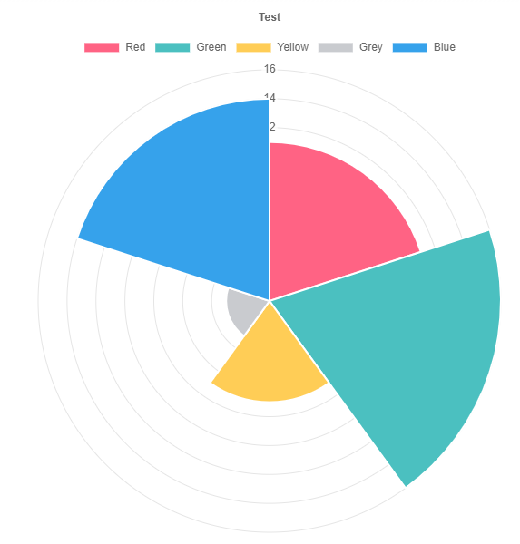

# abap-chart

## line chart


## example code
```abap
DATA(go_chart) = NEW zcl_gui_html_chartjs( ir_parent = go_container ).

go_chart->set_chart_type( 'line' ).

DATA: lt_labels TYPE zcl_gui_html_chartjs=>type_label_t.
APPEND 'Red' TO lt_labels.
APPEND 'Green' TO lt_labels.
APPEND 'Yellow' TO lt_labels.
APPEND 'Grey' TO lt_labels.
APPEND 'Blue' TO lt_labels.

go_chart->set_labels( lt_labels ).

DATA: ls_dataset TYPE zcl_gui_html_chartjs=>type_dataset.

CLEAR: ls_dataset.
ls_dataset-id = '1'.
ls_dataset-label = 'Fehlerfälle'.

APPEND 11 TO ls_dataset-data.
APPEND 16 TO ls_dataset-data.
APPEND 7 TO ls_dataset-data.
APPEND 3 TO ls_dataset-data.
APPEND 14 TO ls_dataset-data.

APPEND 'rgb(255, 99, 132)' TO ls_dataset-background_color.

ls_dataset-fill = zcl_gui_html_chartjs=>gc_bool-true.

go_chart->add_dataset( ls_dataset ).

DATA: ls_options TYPE zcl_gui_html_chartjs=>type_options.
ls_options-plugins-title-display = 'X'.
ls_options-plugins-title-text = 'Titel'.
ls_options-interaction-mode = 'nearest'.
ls_options-interaction-axis = 'x'.
ls_options-interaction-intersect = zcl_gui_html_chartjs=>gc_bool-true.

go_chart->set_options( ls_options ).

go_chart->init_display( ).
```

## bar chart


## polar chart
